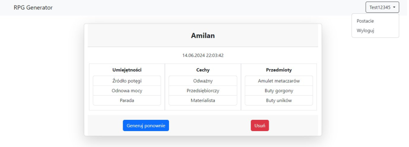
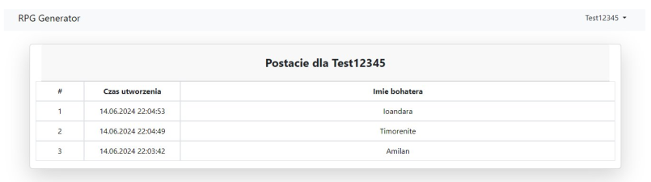
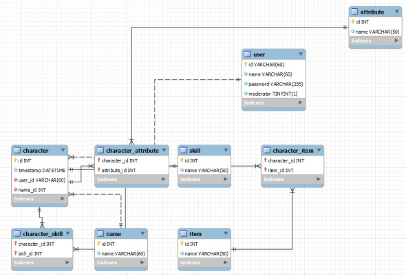

<div align="center">

# RPG-Generator

RPG Cards Generator Web App made using Flask

</div>





<div align="center">

## ERD Schema:



</div>

## Setup:
1. .env configuration:
```python
SQLALCHEMY_DATABASE_URI=<database-connection-string>
```

2. Python libs:
```bash
pip install -r requirements.txt
```

3. Run with:
```bash
flask run --debug
```
